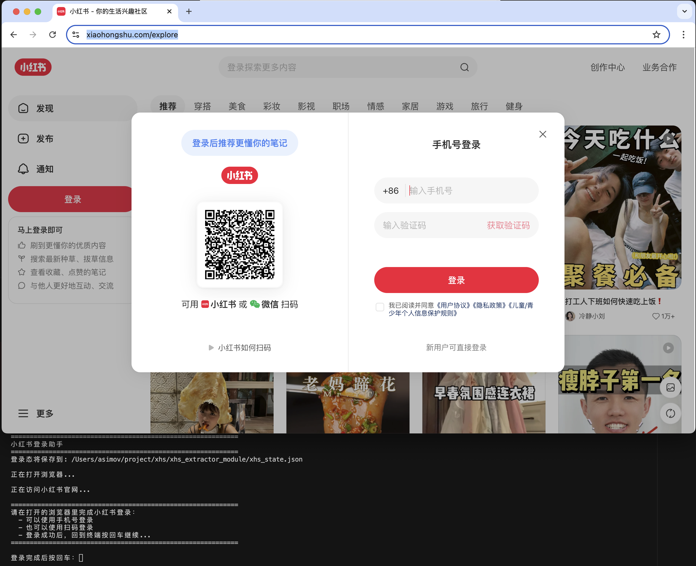
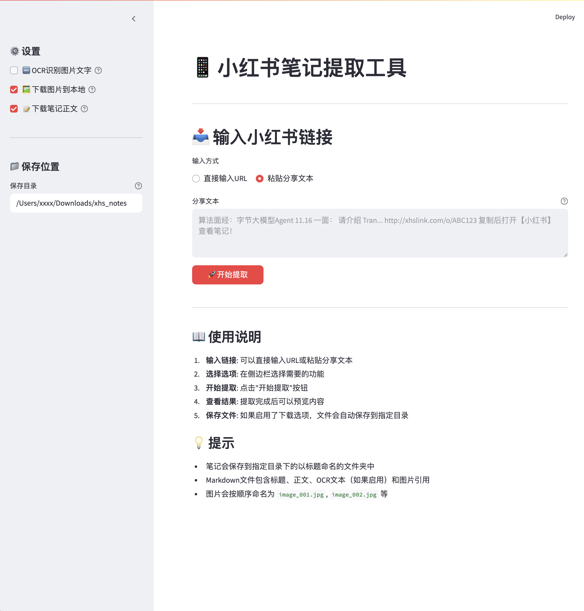
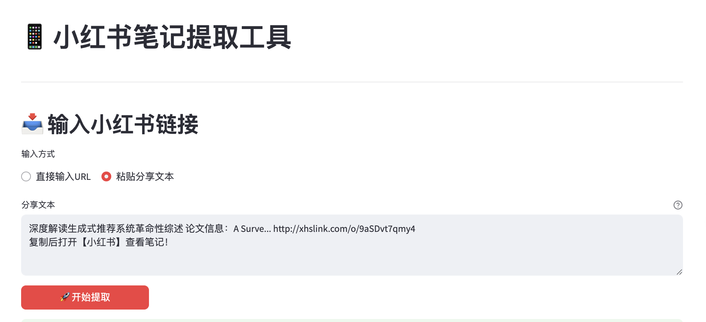
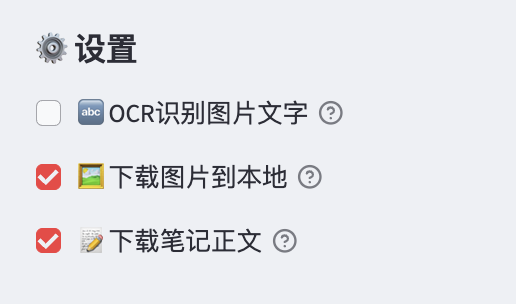
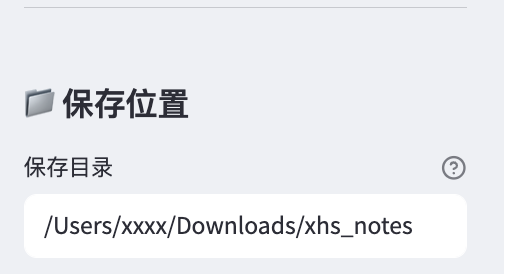
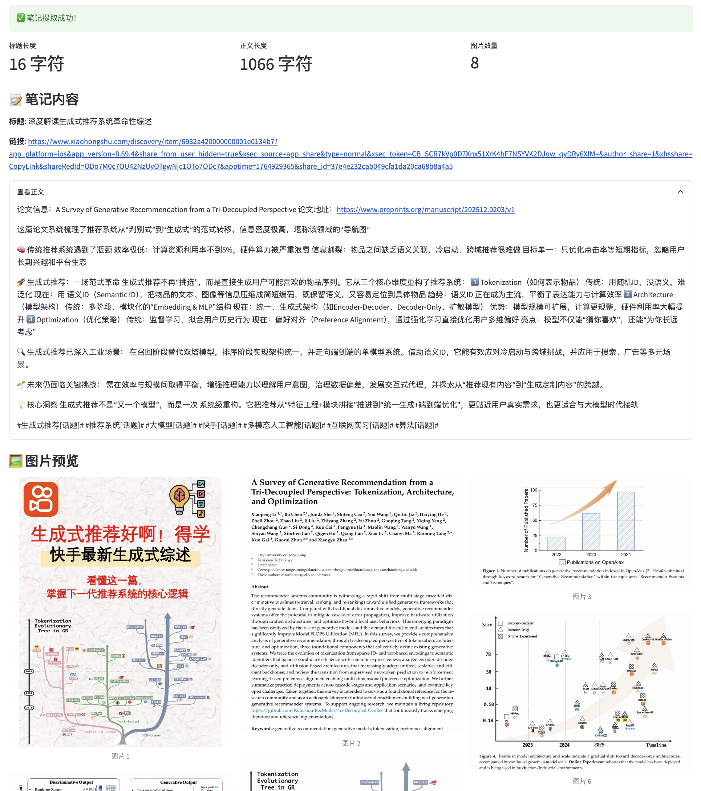
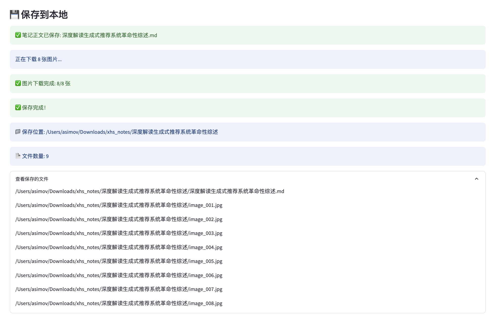

# 📱 小红书笔记提取工具

一个功能完整的小红书（Xiaohongshu）笔记内容提取工具，支持自动登录、内容提取、OCR识别和批量下载。提供命令行工具和Web界面两种使用方式。

**✨ 核心优势**：可以直接通过小红书的分享链接完成笔记提取，支持复制分享文本或直接输入URL链接，一站式完成从链接到内容提取的全部工作，无需手动操作。

## ✨ 核心功能

- 🔐 **自动登录管理**：使用 Playwright 实现网页登录，登录态持久化保存，一次登录长期使用
- 📝 **内容提取**：自动提取笔记标题、正文、图片URL等完整信息
- 🔤 **OCR文字识别**：可选的对图片进行OCR识别，提取图片中的文字内容（适合简单场景，高级需求建议导出后使用多模态LLM）
- 💾 **批量下载**：支持下载笔记正文（Markdown格式）和图片到本地
- 🌐 **Web界面**：提供友好的图形化界面，操作简单直观
- 🖥️ **命令行工具**：提供CLI工具，支持脚本化和自动化

## 🎯 应用场景

- **知识管理**：将小红书笔记整理为本地Markdown文件，便于管理和搜索
- **内容备份**：批量下载和保存喜欢的笔记内容
- **学习笔记**：提取面试题、学习资料等，方便后续复习
- **内容分析**：提取笔记内容用于数据分析、文本处理等
- **自动化处理**：通过CLI工具集成到自动化工作流中

## 🚀 快速开始

### 前置要求

- Python 3.8+
- 已登录的小红书账号

### 安装步骤

1. **获取项目文件**

**方式1：使用Git（推荐，适合有Git经验的用户）**

```bash
git clone https://github.com/yourusername/xhs-extractor.git
cd xhs-extractor
```

**方式2：直接下载（适合非计算机行业从业者）**

1. 访问项目GitHub页面：`https://github.com/yourusername/xhs-extractor`
2. 点击页面右上角的绿色 **"Code"** 按钮
3. 选择 **"Download ZIP"** 下载压缩包
4. 解压下载的ZIP文件到本地目录（如：`~/Downloads/xhs-extractor`）
5. 打开终端，进入解压后的目录：
   ```bash
   cd ~/Downloads/xhs-extractor
   ```

2. **安装依赖**

```bash
pip install playwright requests beautifulsoup4 streamlit
playwright install chromium
```

3. **首次登录（只需一次）**

```bash
python -m xhs_extractor_module.xhs_login
```

这会打开浏览器，完成登录后按回车即可。登录态会自动保存。



> **重要提示**：使用前请先根据指引进行本地小红书登录，拿到cookie信息后会自动保存，后续输入链接不需要再进行登录。登录态保存在 `xhs_extractor_module/xhs_state.json` 文件中，请妥善保管。

### 使用方式

#### 方式1：Web界面（推荐，最简单）

```bash
streamlit run xhs_extractor_module/web_app.py
```



浏览器会自动打开，你可以：
- **输入方式**：
  - 可以直接复制小红书官方的分享链接文本格式（如："算法面经... http://xhslink.com/o/ABC123 复制后打开【小红书】查看笔记！"）
  - 也可以直接复制小红书笔记的URL链接（如：`https://www.xiaohongshu.com/explore/...` 或 `http://xhslink.com/...`）
  - 工具会自动识别输入格式并提取
- 选择是否OCR识别、下载图片、下载正文
- 一键提取和保存

#### 方式2：命令行工具

```bash
# 交互式模式
python -m xhs_extractor_module.cli

# 直接提取（支持两种输入方式）
# 方式1：复制小红书分享文本
python -m xhs_extractor_module.cli "算法面经... http://xhslink.com/o/ABC123 复制后打开【小红书】查看笔记！"

# 方式2：直接输入URL链接
python -m xhs_extractor_module.cli --url "http://xhslink.com/o/ABC123"
# 或
python -m xhs_extractor_module.cli --url "https://www.xiaohongshu.com/explore/..."

# 启用OCR
python -m xhs_extractor_module.cli --ocr "分享文本..."

# 保存到文件
python -m xhs_extractor_module.cli --output result.txt "分享文本..."
```

> **💡 提示**：可以直接复制小红书官方的分享链接文本格式，也可以直接复制小红书笔记的URL链接，工具会自动识别并提取。
```

#### 方式3：Python API

```python
from xhs_extractor_module.xhs_fetch import fetch_note_from_share_text, fetch_note_from_url

# 方式1：使用分享文本提取
share_text = "算法面经... http://xhslink.com/o/ABC123 复制后打开【小红书】查看笔记！"
note = fetch_note_from_share_text(share_text)

# 方式2：直接使用URL提取
note = fetch_note_from_url("http://xhslink.com/o/ABC123")
# 或
note = fetch_note_from_url("https://www.xiaohongshu.com/explore/...")

print(f"标题: {note.title}")
print(f"正文: {note.text}")
print(f"图片: {len(note.images)} 张")
```

> **💡 提示**：支持两种输入方式：
> - 复制小红书官方的分享链接文本格式（包含完整分享文案）
> - 直接使用小红书笔记的URL链接（完整链接或短链接均可）

## 📖 详细文档

- [快速开始指南](xhs_extractor_module/QUICK_START.md) - 3步快速上手
- [CLI使用指南](xhs_extractor_module/CLI_USAGE.md) - 命令行工具详细说明
- [Web应用指南](xhs_extractor_module/WEB_APP_GUIDE.md) - Web界面使用说明
- [OCR使用指南](xhs_extractor_module/OCR_GUIDE.md) - OCR功能说明
- [架构设计文档](xhs_extractor_module/ARCHITECTURE.md) - 技术架构说明

## 🎨 功能演示

### Web界面

启动Web应用后，你可以：

1. **输入链接**：
   - 可以直接复制小红书官方的分享链接文本格式（如："算法面经... http://xhslink.com/o/ABC123 复制后打开【小红书】查看笔记！"）
   - 也可以直接复制小红书笔记的URL链接（如：`https://www.xiaohongshu.com/explore/...` 或 `http://xhslink.com/...`）
   - 工具会自动识别输入格式并提取
   
   

2. **选择功能**：
   - ✅ OCR识别图片文字
   - ✅ 下载图片到本地
   - ✅ 下载笔记正文（Markdown格式）
   
   

3. **设置保存位置**：自定义保存目录
   
   

4. **一键提取**：自动提取并保存
   
   

### 保存的文件结构

```
保存目录/
└── 笔记标题/
    ├── 笔记标题.md          # Markdown格式的笔记正文
    ├── image_001.jpg        # 图片1
    ├── image_002.jpg        # 图片2
    └── ...
```



### Markdown文件内容

保存的Markdown文件包含：
- 笔记标题和链接
- 正文内容
- OCR识别的文字（如果启用）
- 图片引用


> **💡 提示**：导出的Markdown文件可以直接发送给GPT-4V、Claude等多模态LLM模型进行更深入的分析和理解，效果比OCR更好。

## 📦 项目结构

```
xhs-extractor/
├── xhs_extractor_module/     # 核心模块
│   ├── xhs_share.py         # 分享文本解析
│   ├── xhs_login.py         # 登录管理
│   ├── xhs_fetch.py         # 内容抓取
│   ├── xhs_parser.py        # HTML解析（备用方案）
│   ├── ocr.py               # OCR识别
│   ├── models.py            # 数据模型
│   ├── cli.py               # 命令行工具
│   ├── web_app.py           # Web应用
│   └── ...
├── README.md                 # 项目说明（本文件）
├── requirements.txt          # 依赖列表
└── .gitignore               # Git忽略文件
```

## 🔧 配置说明

### 可选依赖

**OCR功能**（可选）：
```bash
pip install paddleocr paddlepaddle
```

> **关于OCR功能的说明**：
> - OCR图片识别功能仅适用于图片以文字为主，需要快速拿到笔记图片里某些文字信息的场景
> - OCR功能识别较慢且效果没有能多模态的大模型能力好
> - 有高级笔记需求还是建议一键将图片和正文导出成markdown文件，拿着文件去问GPT等多模态LLM模型
> - 这样可以获得更好的文字识别效果和更丰富的分析能力

**Web界面**（可选）：
```bash
pip install streamlit
```

### 登录态管理

- 登录态保存在 `xhs_extractor_module/xhs_state.json`
- 登录态过期后，重新运行登录脚本即可

## ⚠️ 注意事项

1. **合法使用**：本工具仅供个人学习和研究使用，请遵守相关法律法规和网站服务条款
2. **登录态安全**：`xhs_state.json` 包含登录信息，请妥善保管，不要分享给他人
3. **使用频率**：请合理使用，避免频繁请求，尊重网站服务器
4. **数据隐私**：提取的内容请妥善保管，注意隐私保护

## 🐛 常见问题

### Q: 提示"未找到登录态文件"

A: 运行 `python -m xhs_extractor_module.xhs_login` 进行首次登录。登录后cookie信息会自动保存，后续使用不需要再次登录。

### Q: OCR功能不可用

A: 安装OCR依赖：`pip install paddleocr paddlepaddle`

### Q: OCR识别效果不好怎么办？

A: OCR功能适合快速提取图片中的简单文字信息。如果需要更准确的识别效果，建议：
1. 使用工具的下载功能，将笔记正文和图片导出为Markdown文件
2. 将Markdown文件（包含图片）发送给GPT-4V、Claude等多模态LLM模型
3. 多模态模型对图片的理解和文字识别能力更强，可以获得更好的效果

### Q: 提取失败或内容为空

A: 
- 检查登录态是否过期（重新登录）
- 确认分享文本中包含有效链接
- 检查网络连接

### Q: Web应用无法启动

A: 
- 确认已安装streamlit：`pip install streamlit`
- 确保从项目根目录运行：`streamlit run xhs_extractor_module/web_app.py`

## 🤝 贡献

欢迎提交 Issue 和 Pull Request！

## 📄 许可证

本项目仅供学习和研究使用。请遵守相关法律法规和网站服务条款。

## 🙏 致谢

- [Playwright](https://playwright.dev/) - 浏览器自动化
- [PaddleOCR](https://github.com/PaddlePaddle/PaddleOCR) - OCR识别
- [Streamlit](https://streamlit.io/) - Web界面框架

## 📝 更新日志

### v1.0.0
- ✅ 实现Playwright自动登录和登录态管理
- ✅ 实现笔记内容提取（标题、正文、图片）
- ✅ 实现OCR图片文字识别
- ✅ 实现命令行工具（CLI）
- ✅ 实现Web图形界面
- ✅ 实现批量下载功能
- ✅ 支持Markdown格式保存

---

**⭐ 如果这个项目对你有帮助，欢迎给个Star！**

